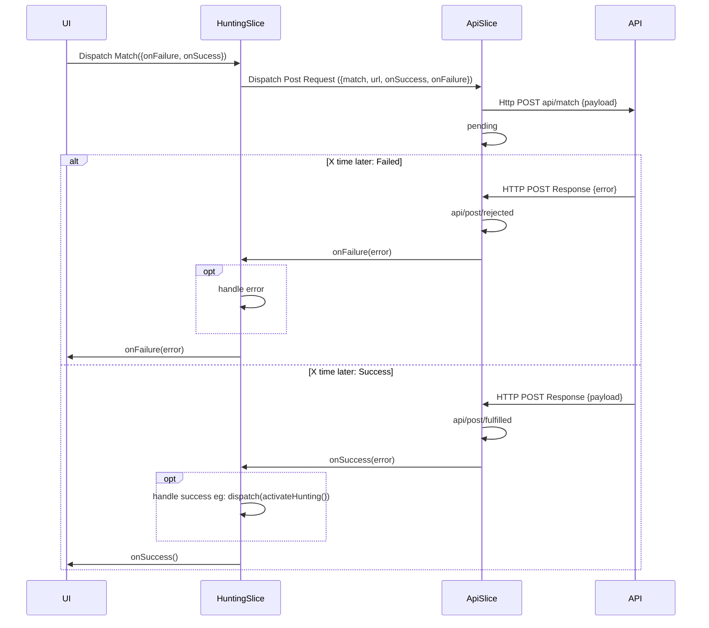

# HuHHU

## How async State Management works (generally):


## Our State Management is similar:


### Async Thunk: (the thing beeing dispatched)
`state/huntingSlice.ts`
```typescript
export const match = ({onFailure }:ActionArgs<{ }>) => post<MatchRequest,MatchResponse>({
    requestType: match.name,
    url: apiUrl+"/match",
    payload: ({getState}) => {
        return {
            clientCode: getState().auth.code
        }
    },
    success: ({payload,dispatch}) => {
        dispatch(activateHunting())
        console.log("matched with: ",payload.matchName)
    },
    failure: () => onFailure
})
```


### Reducer (the thing beeing combined with state):
`state/huntingSlice.ts`
```typescript
const huntingSlice = createSlice({
    name: 'hunting',
    initialState,
    reducers: {
        activateHunting(state){
            state.huntingActive = true
        },
    },
});
```

### ApiSlice
`state/apiSlice.ts`
```typescript
const apiSlice = createSlice({
    name: 'api',
    initialState,
    reducers: {},
    extraReducers: (builder) => {
        builder
            .addCase(postData.pending, (state, action) => {
                //...
            })
            .addCase(postData.fulfilled, (state, action) => {
                //...
            })
            .addCase(postData.rejected, (state, action) => {
                //...
            })
    },
});
```
Action Creator Wrapper
```typescript
export const post = <RequestType,ResponseType>(request: PostRequestArguments<RequestType,ResponseType>) =>  async (dispatch, getState)=> {
    dispatch(postData(/*...*/))
        .then(({payload})=> request.success(/*...*/))
        .catch((error)=> request.failure(/*...*/));
}
```

Action Creator (Api Action)
```typescript
export const postData = createAsyncThunk<any, {url:string, payload:any,  requestType: string}>(
    'api/postData',
    async <T, AdditionalParam>(params: { url: string; payload: T, requestType:string }) => {
        return callApi(params.url, 'POST', params.payload);
    }
);
```

### Store
`state/store.ts`
```typescript
const store = configureStore({
    reducer: {
        user: userReducer,
        hunting: huntingReducer,
        auth: authReducer,
        api: apiReducer
    },
});
```


### Dispatch (queue the action)
`screens/HuntingScreen.tsx`
```typescript
const dispatch: AppDispatch = useDispatch();
dispatch(match({
    onFailure: flashError,
    args:{}
}))
```

